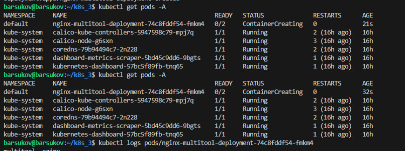
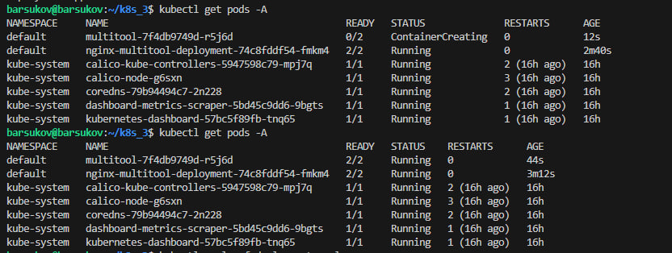
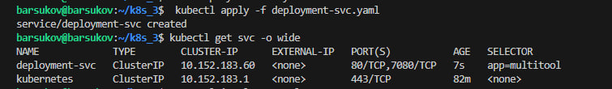
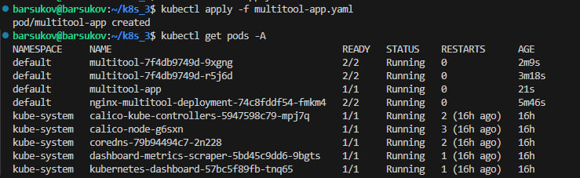
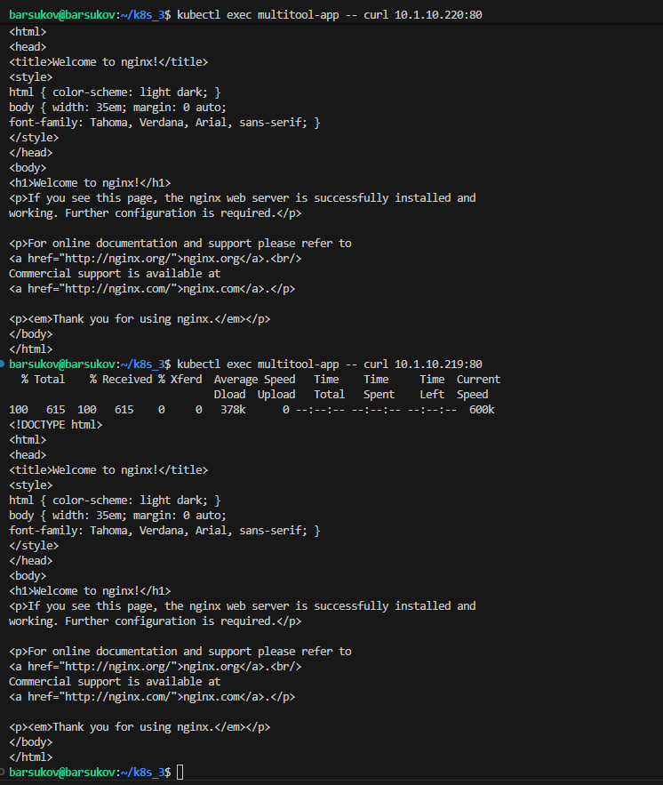
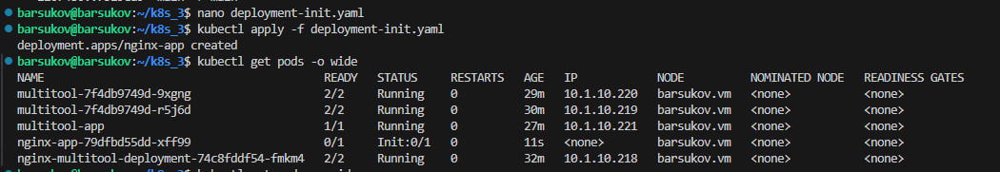
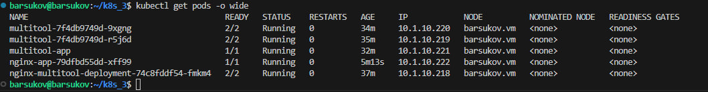

# Домашнее задание к занятию «Запуск приложений в K8S» Барсуков Алексей

### Цель задания

В тестовой среде для работы с Kubernetes, установленной в предыдущем ДЗ, необходимо развернуть Deployment с приложением, состоящим из нескольких контейнеров, и масштабировать его.

------

### Чеклист готовности к домашнему заданию

1. Установленное k8s-решение (например, MicroK8S).
2. Установленный локальный kubectl.
3. Редактор YAML-файлов с подключённым git-репозиторием.

------

### Инструменты и дополнительные материалы, которые пригодятся для выполнения задания

1. [Описание](https://kubernetes.io/docs/concepts/workloads/controllers/deployment/) Deployment и примеры манифестов.
2. [Описание](https://kubernetes.io/docs/concepts/workloads/pods/init-containers/) Init-контейнеров.
3. [Описание](https://github.com/wbitt/Network-MultiTool) Multitool.

------

### Задание 1. Создать Deployment и обеспечить доступ к репликам приложения из другого Pod

1. Создать Deployment приложения, состоящего из двух контейнеров — nginx и multitool. Решить возникшую ошибку.
2. После запуска увеличить количество реплик работающего приложения до 2.
3. Продемонстрировать количество подов до и после масштабирования.
4. Создать Service, который обеспечит доступ до реплик приложений из п.1.
5. Создать отдельный Pod с приложением multitool и убедиться с помощью `curl`, что из пода есть доступ до приложений из п.1.

------

### Задание 2. Создать Deployment и обеспечить старт основного контейнера при выполнении условий

1. Создать Deployment приложения nginx и обеспечить старт контейнера только после того, как будет запущен сервис этого приложения.
2. Убедиться, что nginx не стартует. В качестве Init-контейнера взять busybox.
3. Создать и запустить Service. Убедиться, что Init запустился.
4. Продемонстрировать состояние пода до и после запуска сервиса.

------

### ОТВЕТ

### Задание 1.

Создаем deployment.yaml

```
apiVersion: apps/v1
kind: Deployment
metadata:
  name: multitool
spec:
  replicas: 1
  selector:
    matchLabels:
      app: multitool
  template:
    metadata:
      labels:
        app: multitool
    spec:
      containers:
      - name: nginx
        image: nginx:latest
        ports:
        - containerPort: 80
      - name: multitool
        image: wbitt/network-multitool:latest
        ports:
        - containerPort: 8080
```

Затем 

barsukov@barsukov:~/k8s_3$ kubectl apply -f deployment.yaml

Ошибка была связана с тем, что nginx и multitool по-умолчанию используют порт 80. multitool перенастроил на порт 8080.


Добавляем в deployment.yaml 

```
env:
        - name: HTTP_PORT
          value: "7080"
```


Получаем

```
apiVersion: apps/v1
kind: Deployment
metadata:
  name: multitool
spec:
  replicas: 1
  selector:
    matchLabels:
      app: multitool
  template:
    metadata:
      labels:
        app: multitool
    spec:
      containers:
      - name: nginx
        image: nginx:latest
        ports:
        - containerPort: 80
      - name: multitool
        image: wbitt/network-multitool:latest
        ports:
        - containerPort: 8080
        env:
        - name: HTTP_PORT
          value: "7080"
```

barsukov@barsukov:~/k8s_3$ kubectl apply -f deployment.yaml



Меняем количество реплик с 1 на 2




Создаем Service, который обеспечит доступ до реплик приложений из предыдущих пунктов

root@DebianNew:~/.kube# nano deployment-svc.yaml

```
apiVersion: v1
kind: Service
metadata:
  name: deployment-svc
spec:
  selector:
    app: multitool
  ports:
  - name: for-nginx
    port: 80
    targetPort: 80
  - name: for-multitool
    port: 7080
    targetPort: 7080
```



Создаём отдельный Pod с приложением multitool и убеждаемся с помощью curl, что из пода есть доступ до приложений из предыдущих пунктов

root@DebianNew:~/.kube# nano multitool-app.yaml

```
apiVersion: v1
kind: Pod
metadata:
  labels:
    app: multitool
  name: multitool-app
  namespace: default
spec:
  containers:
  - name: multitool
    image: wbitt/network-multitool
    ports:
    - containerPort: 8080
    env:
      - name: HTTP_PORT
        value: "7080"
```




```
barsukov@barsukov:~/k8s_3$ kubectl exec multitool-app -- curl 10.1.10.220:80 
barsukov@barsukov:~/k8s_3$ kubectl exec multitool-app -- curl 10.1.10.219:80  
```


### Задание 2.


Создадим deployment-init.yaml

```
apiVersion: apps/v1
kind: Deployment
metadata:
  labels:
    app: nginx-app
  name: nginx-app
  namespace: default
spec:
  replicas: 1
  selector:
    matchLabels:
      app: nginx
  template:
    metadata:
      labels:
        app: nginx
    spec:
      containers:
      - name: nginx
        image: nginx:latest
        ports:
        - containerPort: 80
      initContainers:
      - name: init-nginx-svc
        image: busybox
        command: ['sh', '-c', 'until nslookup nginx-svc.default.svc.cluster.local; do echo waiting for nginx-svc; sleep 5; done;']
```


Nginx не стартует




Создадим Service nginx-svc.yaml и убедимся, что init запустился


barsukov@barsukov:~/k8s_3$ nano nginx-svc.yaml

```
apiVersion: v1
kind: Service
metadata:
  name: nginx-svc
spec:
  selector:
    app: nginx
  ports:
  - name: http-port
    port: 80
    protocol: TCP
    targetPort: 80
```

barsukov@barsukov:~/k8s_3$ kubectl apply -f nginx-svc.yaml 

barsukov@barsukov:~/k8s_3$ kubectl get pods -o wide


